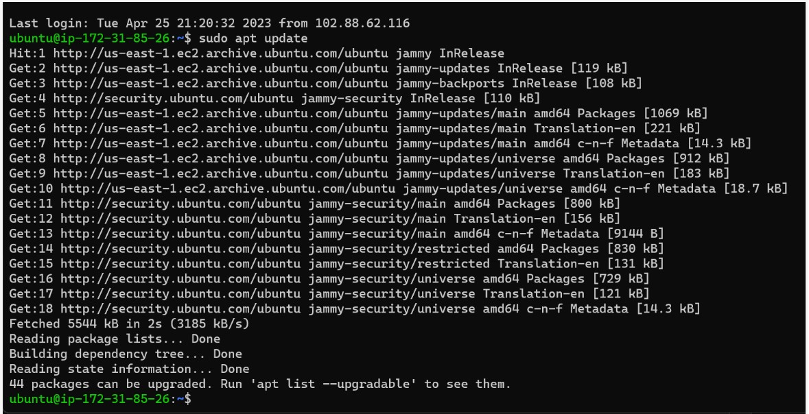
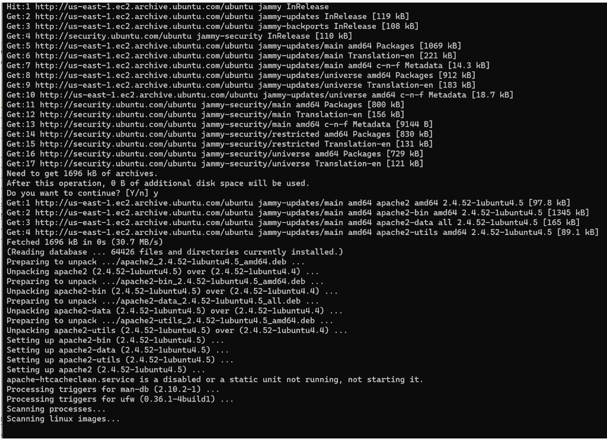
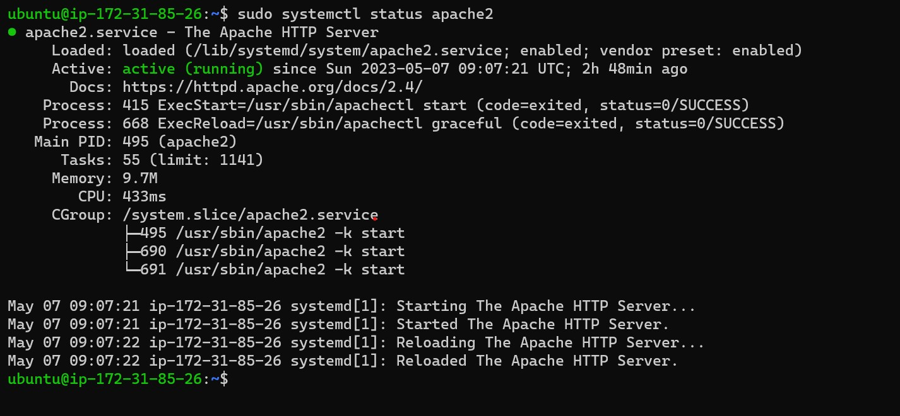
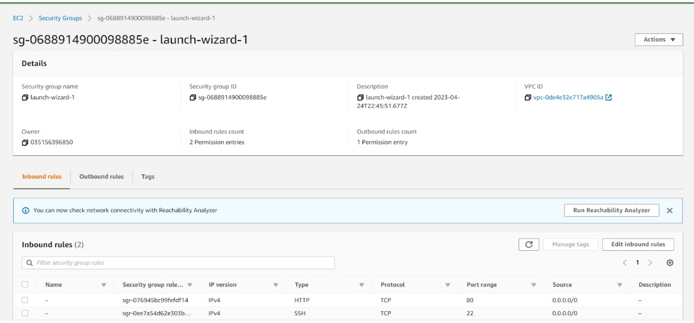
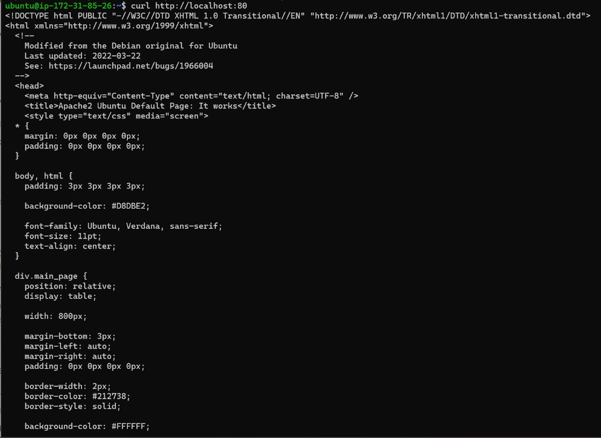
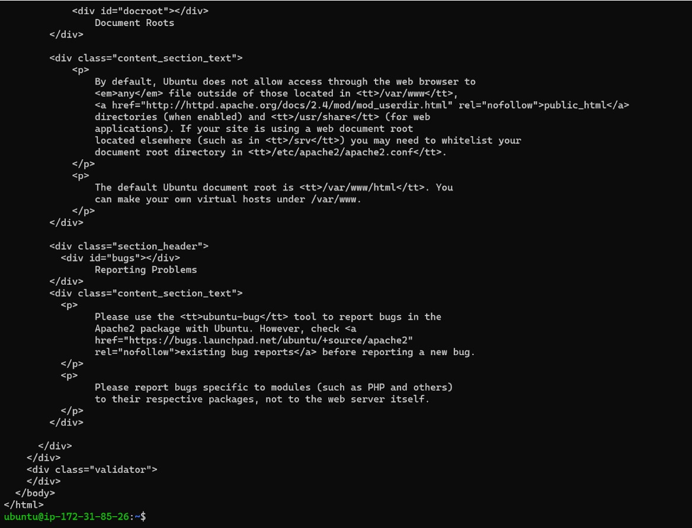
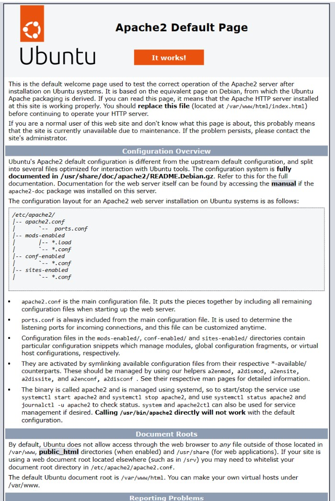
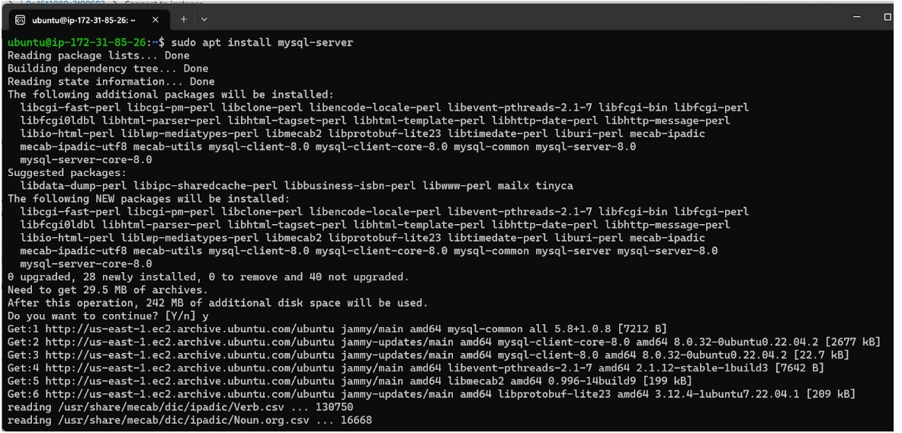
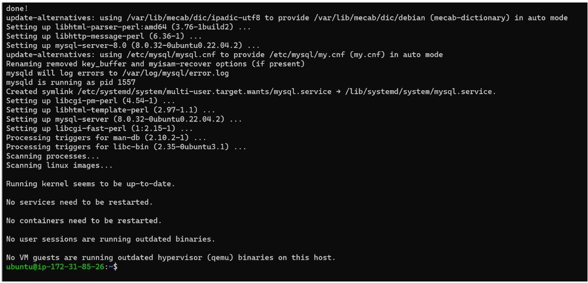

## PROJECT 1: LAMP STACK IMPLEMENTATION

### I started the Installation of Apache using Ubuntu’s package manager

### First, I started by updating the list of packages in package manager by running the below command.

 `sudo apt update`

 

 ### Run apache2 package installation by running the command "sudo apt install apache2"

 `sudo apt install apache2`

 

 ### Run apache2 package installation by running the command "sudo apt install apache2"

 `sudo apt install apache2`

 

### To receive any traffic in our Web Server, we need to open TCP port 80 which is the default port that web browsers use to access web pages on the Internet.
### - Check the box in front of the EC2 instance, select security, and click on security group link, and click on edit inbound rule, add HTTP configuration inbound connection through protocol with default port 80 as shown below.

 

 ### To check if we can access it locally in our Ubuntu shell, we have to run the below command.

 `curl http://localhost:80`, or `curl http://127.0.0.1:8`

### To test and confirm how our Apache HTTP server responds to requests from the Internet. I opened the Microsoft Edge web browser and ran the below http link through my url, and the web server is correctly installed and accessible through my firewall.

`http://3.84.6.47:80`

### - I also use the below command to retrive my AWS Web console public IP

`curl -s http://169.254.169.254/latest/meta-data/public-ipv4`

## STEP 2 — INSTALLING MYSQL

### To help store and manage data for my Apache web Server, MYSQL database management system (DBMS) will be installed using the below command, and then confirm yes (y) for additional disk space of 242 M to be used.

`sudo apt install mysql-server`

- [PROJECT 1: LAMP STACK IMPLEMENTATION](https://github.com/Tasbaba/Project-1/blob/main/project-1.md)

 